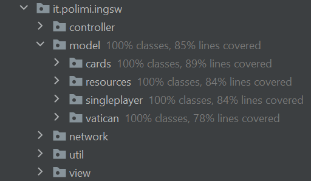

# ing-sw-2021-mercurio-niantcho-tosini

**Final Examination of Software Engineering** 

**Politecnico di Milano**

**A.Y. 2020-2021**

**Professor:** Pierluigi San Pietro

**Group:** PSP47

**Students**:
- Alessandro Mercurio (907992)
- Francesco Tosini (916715)
- Patrick Orelien Niantcho Njanda (914440)

## Subject

Aim of this project is to design, develop, test and deploy a distributed application: a digital version of the board game "Master of Renaissance" by **Cranio Creations***.

See [Requirements](deliverables/requirements.pdf) to read the full project specifications and requirements (in Italian).

***DISCLAIMER**: WE DO NOT OWN ANY OF THE RESOURCES USED TO REPRODUCE THIS GAME. Every material and graphic resource belong to Cranio Creations Srl (http://www.craniocreations.it/).
What we do own is the code which we wrote the software in.

## Implemented features

| Feature | Implemented |
| ------- | ----------- |
| Complete rules | :heavy_check_mark: |
| CLI | :heavy_check_mark: |
| GUI | :heavy_check_mark: |
| Socket | :heavy_check_mark: |
| Advanced functionality 1 (FA 1) | :heavy_check_mark: Multiple matches ("Partite multiple") |
| Advanced functionality 2 (FA 2) | :heavy_check_mark: Offline match ("Partita locale") |
| Advanced functionality 3 (FA 3) | :heavy_check_mark: Disconnection resilience ("Resilienza alle disconnessioni") |


## Testing

Extensive testing has been performed on all parts of the software, by writing unit tests where possible and with manual QA.
The unit tests cover 100% of the classes, 88% of methods and 85% of lines of the Model package. The few non-covered lines mainly deal with simple loading/getting/setting of data.  



## Compile

To simply run the game, you just need to:
1. Install [Java SE 15](https://docs.oracle.com/en/java/javase/15/)
2. Install [Maven](https://maven.apache.org/install.html)
3. Clone this repository
4. If you want to run the tests and compile the software from scratch, which is the safest option, run:
   ```bash
    mvn package
    ```
   and go to the newly created ```shade``` folder.
   Otherwise, just head to ```deliverables/final/jar```.
5. You will find three JAR files:

   - ```server.jar```, to run the server
   - ```cli.jar```, to run the client in CLI mode
   - ```gui.jar```, to run the client in GUI mode  

   Please note that you will need an ANSI terminal with 8-bit colors and extended ASCII support to correctly experience the CLI version.
6. If you want to play offline, skip to 7. Otherwise, someone needs to launch the server first: in the terminal run
    ```bash
    java -jar server.jar
    ```
   You should see a message like this:
    ```bash
    (SERVER) >> Server ready on port 2703
    ```
   with a variable port number (a free port is picked up randomly). 
   You will need this later, together with the IP address of the machine running the server, to connect.
7. You can now run the clients:
    - GUI: 
       ```bash
       java -jar gui.jar
       ```
       or double-click on the jar file.
    - CLI:
       ```bash
       java -jar cli.jar
       ```
8. To play:
   - online: insert the IP address of the server and port number it is running on.
   - offline: click ```Play Offline``` (GUI) or type ```offline``` (CLI).
9. Have fun! :smile:
